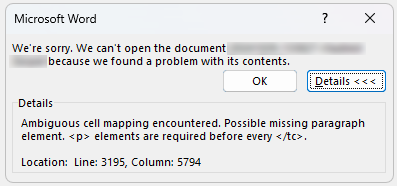

# WordprocessingML

## Prepare schema

Schema defines what eWay-CRM data will be available in the template. eWay-CRM exports all available data from the appropriate
items. If you have custom fields you will have to create custom schema and add required custom fields there. Create new folder in your local Transformations directory (similar structure to what we have in Templates folder), copy Schema + transform files from one of the templates into the created one.

See our schema for [Invoices](Templates/Invoice/Invoice.xsd) or use the custom schema you copied in previous action.
If you for example have a custom field af_14 (your may use Alt + F1 shortcut on a control in eWay-CRM to get it's internal name) on Bookkeeping module, you may modify schema like this:

```xml
<xs:element name="Active" type="xs:string" minOccurs="0" />
<xs:element name="af_14" type="xs:string" minOccurs="0" />
<xs:element name="CreatedByGUID" type="xs:string" minOccurs="0" />
```

You should also modify schema namespace to some unique name. In this case we renamed Invoice to MyInvoice:

```xml
<?xml version="1.0" encoding="utf-8"?>
<xs:schema targetNamespace="urn:eway:document-schemas:MyInvoice"
    elementFormDefault="qualified"
    xmlns="urn:eway:document-schemas:Invoice"
    xmlns:xs="http://www.w3.org/2001/XMLSchema">
```

Root element of the schema is the item being exported. It contains all of it's attributes as child elements. Some child elements
represent other related items which also have own child elements. Common items are:
* **Owner** - User who owns the item being exported
* **CreatedBy** - User who created the item being exported
* **ModifiedBy** - User who modified the item being exported
* **SystemData**
  * **CurrentDate** - Date when the item was exported
  * **CurrentTime** - Time when the item was exported
  * **CurrentYear** - Year in that the item was exported
  * **CurrentMonth** - Month in that the item was exported
  * **CurrentDay** - Day in that the item was exported
  * **DefaultCurrency** - Default currency in ISO format
* **MyCompany** - Information about company from [global settings](https://kb.eway-crm.com/documentation/5-administration-application/5-7-global-settings/category-company-details/city-name-registration-number-street-vat-number-zip)
  * **MyCompanyCity**
  * **MyCompanyId**
  * **MyCompanyName**
  * **MyCompanyStreet**
  * **MyCompanyState**
  * **MyCompanyCountry**
  * **MyCompanyVatNumber**
  * **MyCompanyZip**

Based on exported item type, there are some additional elements available:
* **Bookkeeping** (Carts)
  * **Customer**
  * **ContactPerson**
  * **SuperiorItem**

* **Contacts**
  * **Company**

* **Deals** (Leads)
  * **Customer**
  * **ContactPerson**

* **Projects**
  * **Customer**
  * **ContactPerson**
  * **Supervisor**
  * **SuperiorProject**

Default schemas are available [here](Schemas/).

## Create template

Install Word 2003 Professional with SP3. It is recommended to have XML Structure pane visible (in Word 2003 right click on upper pane - Own - Commands - All commands - Show XML Structure).

Open Word 2003 with client's defined template (or create a new empty document).

Go to **Tools** and click **Templates and Add-Ins...** and add the MyInvoice schema that was mentioned before (or custom Schema you copied in previous action).


In **XML Options** check these options:
* Validate document against attached schemas
* Ignore mixed content
* Show advanced XML error messages


It is recommended to add only one schema at a time. After you add schema to the document, XML Structure panel will appear on the right (if not, click on Show XML Structure on the upper pane):


Click on the element available (in this case Proposal) and apply it to the whole document:


In the document select text that you want to replace by data from eWay-CRM. In the right pane select the appropriate
element.


Make sure that elements that will be replaced by values are filled with color.


If it has white background move focus after the tag end (in this case MyCompanyName) and press space to fix the format. After the background color gets
applied you can remove the space.


Elements could be used only in template body (not in header / footer). For easier template editing it is possible to hide the elements by CTRL+SHIFT+X.

## Publish template

As soon as the template is finished you have to save it as XML and publish it to eWay-CRM.

You need to generate SQL script that has to be executed against eWay-CRM server database. To generate the SQL
edit [transform.bat](Templates/Carts/Invoice/transform.bat) in Notepad.

**transform.bat** has those parameters in the following order:
* Path to the template document
* XML Namespace from the schema (eg. urn:eway:document-schemas:MyInvoice)
* Name of the template that will be displayed in eWay-CRM
* [FolderName](https://github.com/eway-crm/php-lib/blob/master/FolderNames.md) in which will be the template available
  * **Carts**
  * **Companies**
  * **Contacts**
  * **Projects**
  * **Leads**
* Language in two letter format. Default is en.
  * **en**
  * **cs**
  * **de**
  * **ru**
  * **sk**
  * **no**
* Version of the template. Defaults to **2**.
* **1** to duplicate tempalte to other languages. Using this template will be available in eWay-CRM in all supported languages.

After you save and run **transform.bat**, it runs a **Wml2Ew.exe** utility and SQL file will be created with the same name as name of the template document.

As soon as you execute the SQL script on the eWay-CRM server database users should be able to [see the template in eWay-CRM](https://kb.eway-crm.com/documentation/3-description/3-6-integration-with-microsoft-office/3-6-2-microsoft-word-and-excel/data-export-into-ms-word).


## Troubleshooting

* Error after export from eWay-CRM: `Ambigous cell mapping encountered. Possible missing paragpraph element. <p> elements are required before every </tc>`



Solution: There is probably white outer AF element in word template, which must be corrected to pink (see the last part of **Create template** section)

